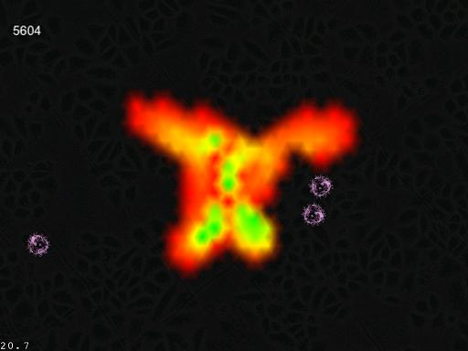

Amoeba (Old)
============

Old version of Amoeba game

* Built with Cocos2d v1.0.0-rc3
* Works with XCode 4.5.1
* Works on iOS 5.0 and iOS 5.1
* Scaling issues present on iOS 6.0

Gameplay
-------------

This version of the Amoeba game is fully playable. The player controls the Amoeba blob 
in the center of the screen by spreading it out with one or more fingers. When the enemies 
approach, they will eat away at the Amoeba, reducing its overall life. To defeat an 
enemy, the player must use the Amoeba to completely surround it, which will kill the 
enemy and provide the Amoeba with additional life.

Currently, there are no objectives except to survive as long as possible.

Technical Features
------------------

* Amoeba is colored with a gradient from green to red, which indicates the amount of life
* Amoeba automatically condenses toward the middle to make gameplay less frustrating
